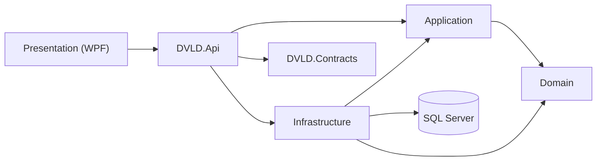

# DVLD Architecture Guide

## Dependency flow



## Responsibility matrix

| Project | Responsibility |
|---|---|
| Domain | Core business model |
| Application | Use cases, services, DTOs, validation |
| Infrastructure | EF Core, repositories, Unit of Work, transactions |
| DVLD.Contracts | API request/response contracts |
| API | HTTP, authentication, authorization, mapping |
| Presentation (WPF) | Views, ViewModels, Commands, UserControls |

## Request flow

```text
Client → Controller → Application Service → Repository/UoW → EF Core → SQL Server
```

## Transaction flow

```text
Begin Transaction
↓
Read protected state
↓
Validate
↓
Write related records
↓
SaveChanges
↓
Commit
```

## Unit of Work rationale

Multi-step workflows need a shared persistence boundary. Otherwise independent DbContexts/commits can allow partial completion.

## Development rule

Keep controllers thin, keep EF/SQL in Infrastructure, keep business workflows in Application/Domain, and protect concurrency-sensitive invariants with transactions.
