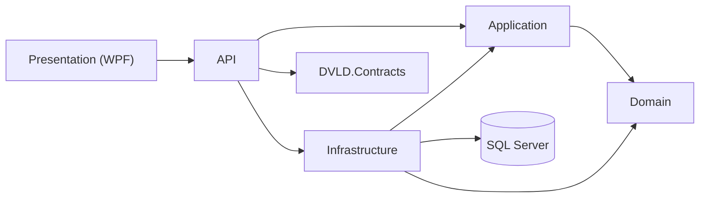

# DVLD — System Documentation

> **Documentation status:** Source-oriented documentation for the current repository state. Implemented behavior is documented as current. Anything not confirmed from source is marked **Needs verification**.

## 1. Executive Summary

DVLD (Driving & Vehicle License Department) is a C#/.NET 8 system for managing the operational records and workflows of a driving-license department.

The solution separates domain concepts, application use cases, infrastructure/database access, API contracts, HTTP endpoints, and the WPF presentation layer.

Current solution areas include Domain, Application, Infrastructure, DVLD.Contracts, ASP.NET Core Web API, WPF/MVVM presentation, automated tests, and Azure DevOps CI configuration.

## 2. Project Overview

The system manages:

- People
- Users
- Drivers
- Countries
- Application types
- License classes
- Applications
- Local driving-license applications
- Test types
- Test appointments
- Test results
- Licenses
- Detained licenses
- International licenses
- Dashboard statistics

## 3. Goals and Scope

### In scope

- CRUD/query operations for core entities
- Application lifecycle
- Local driving-license workflow
- Test scheduling and result recording
- First-license issuance
- Renewal
- Replacement
- Detention and release
- International-license issuance
- User authentication and profile management
- SQL Server persistence
- Automated testing
- WPF client

### Needs verification

Any capability not represented by source code, tests, or configuration should not be documented as implemented.

## 4. Technology Stack

| Area | Technology |
|---|---|
| Language | C# |
| Runtime | .NET 8 |
| API | ASP.NET Core Web API |
| ORM | Entity Framework Core 8 |
| Database | SQL Server |
| Desktop UI | WPF |
| UI pattern | MVVM |
| Authentication | JWT |
| Authorization | ASP.NET Core policies |
| Password hashing | BCrypt |
| Persistence | Repository + Unit of Work |
| Contracts | DVLD.Contracts |
| Testing | Unit + integration tests |
| CI | Azure DevOps Pipelines |
| Source control | Git / GitHub |

## 5. Solution Architecture

### 5.1 Architecture Overview



### 5.2 Layer Responsibilities

**Domain:** core entities, enums, and business concepts. It should not depend on ASP.NET Core, WPF, or SQL Server.

**Application:** use cases, service interfaces/implementations, DTOs, validation, workflow coordination, Result types, pagination, and current-user abstractions.

**Infrastructure:** EF Core DbContext/configuration, repositories, Unit of Work, transactions, SQL Server persistence, and infrastructure implementations of Application interfaces.

**DVLD.Contracts:** API-facing request and response contracts, keeping transport models separate from internal Application DTOs.

**API:** HTTP routing, authentication/authorization integration, request binding, Application-service calls, response mapping, and API-wide error handling.

**Presentation (WPF):** Views, ViewModels, Commands, UserControls, and desktop presentation state.

### 5.3 Dependency Direction

```text
Presentation → API → Application → Domain
Infrastructure → Application
Infrastructure → Domain
API → Infrastructure
Infrastructure → SQL Server
API → DVLD.Contracts
```

### 5.4 Project Structure

```text
DVLD-WPF/
├── Domain/
├── Application/
├── Infrastructure/
├── DVLD.Contracts/
├── API/
│   └── DVLD.Api/
├── Presentation (WPF)/
├── Test/
└── docs/
```

## 6. Domain Model

The EF model currently contains:

- Applications
- ApplicationTypes
- Countries
- DetainedLicenses
- Drivers
- InternationalLicenses
- Licenses
- LicenseClasses
- LocalDrivingLicenseApplications
- People
- Tests
- TestAppointments
- TestTypes
- Users

### 6.1 Main Relationships

- Person is referenced by Applications, Drivers, and Users.
- Person belongs to a Country.
- Application references applicant Person, ApplicationType, and creating User.
- LocalDrivingLicenseApplication references Application and LicenseClass.
- TestAppointment references LocalDrivingLicenseApplication, TestType, creating User, and optionally a retake application.
- Test is one-to-one with TestAppointment.
- License references Application, Driver, LicenseClass, and creating User.
- DetainedLicense references License, creating User, and optional release application/releasing User.
- InternationalLicense references Application, Driver, source local license, and creating User.

### 6.2 Important Business Rules Confirmed in Source

- National numbers are unique.
- Usernames are unique.
- A Person can have at most one User through a unique PersonId constraint.
- A Driver is uniquely associated with a Person.
- A License has at most one active record for a Driver + LicenseClass combination.
- A Driver cannot have more than one active InternationalLicense.
- A License cannot have more than one unreleased detention record.
- A TestAppointment can have at most one Test result.

## 7. Application Layer

### 7.1 Services

The Application layer contains service abstractions/implementations for authentication, users, people, applications, local driving-license applications, test appointments/workflow/tests, drivers, licenses, issuance, renewal, replacement, detention, international licenses, dashboard, countries, application types, license classes, and test types.

### 7.2 DTOs

Application DTOs represent use-case data and keep services/controllers from depending directly on persistence entities.

### 7.3 Interfaces

Application interfaces provide abstractions for repositories, Unit of Work, current-user access, and application services.

### 7.4 Validation

Validation occurs at request boundaries, Application services, workflow rules, and database constraints.

Backend validation is authoritative because a client UI can be bypassed.

### 7.5 Result Pattern

The project uses Result and Result<T> for explicit operation outcomes.

Known categories include:

- Validation
- NotFound
- Conflict
- Forbidden
- Failure

The API converts these results into HTTP responses through a shared mapping layer.

## 8. Infrastructure

### 8.1 DbContext

EF Core is used to persist the domain model to SQL Server.

### 8.2 EF Core

The model snapshot reports EF Core 8.0.18.

Configuration includes required properties, max lengths, decimal precision, foreign keys, delete behaviors, unique indexes, and filtered unique indexes.

### 8.3 Repositories

Repositories encapsulate database operations and keep persistence-specific queries out of Application services.

### 8.4 Unit of Work

Unit of Work coordinates related repository operations within one persistence boundary.

This is important for multi-step operations where several writes must succeed or fail together.

### 8.5 Transactions

Critical workflows use explicit transactions.

The test-result workflow is protected by a Serializable transaction and coordinates appointment validation, Test creation, appointment locking, SaveChanges, and commit/rollback.

International-license issuance is also transactional.

### 8.6 Database Access

SQL Server is accessed through Infrastructure/EF Core rather than directly from controllers.

## 9. API

### 9.1 API Architecture

```text
HTTP Request
    ↓
Controller
    ↓
Application Service
    ↓
Repository / Unit of Work
    ↓
EF Core
    ↓
SQL Server
```

### 9.2 Controllers

Current controller areas include:

Auth, People, Applications, ApplicationTypes, Countries, Dashboard, DetainedLicenses, Drivers, InternationalLicenses, LicenseClasses, LicenseIssuance, LicenseRenewal, LicenseReplacement, Licenses, LocalDrivingLicenseApplications, TestAppointments, TestTypes, TestWorkflow, Tests, and Users.

### 9.3 Endpoints

See API.md for the route inventory.

### 9.4 Request/Response

Confirmed examples:

- LoginRequest / LoginResponse
- IssueFirstLicenseRequest / IssueFirstLicenseResponse
- RenewLicenseRequest
- ReplaceLicenseRequest
- CreateDetainedLicenseRequest
- ReleaseDetainedLicenseRequest
- ScheduleTestRequest
- SaveTestResultRequest

### 9.5 Error Handling

Controllers use the shared Result-to-HTTP mapping mechanism. Global API error handling is used for unexpected exceptions.

### 9.6 Authentication/Authorization

JWT authentication is implemented. Policies such as StaffOnly, StaffOrAdmin, and AdminOnly are applied at controller/action level.

The login action is anonymous and rate limited.

## 10. Presentation

The WPF client uses MVVM.

- **WPF:** desktop UI.
- **MVVM:** Views bind to ViewModels.
- **ViewModels:** expose UI state and commands.
- **Commands:** connect user actions to ViewModel operations.
- **UserControls:** reusable presentation components.

## 11. Major Business Workflows

### 11.1 Local Driving License Application

```text
Person
  ↓
Application
  ↓
LocalDrivingLicenseApplication
  ↓
Test scheduling
  ↓
Theory / Written / Practical
  ↓
All required tests passed
  ↓
License issuance
```

### 11.2 Test

The current TestService flow:

1. Require an authenticated user.
2. Start a Serializable transaction.
3. Get the appointment for the protected operation.
4. Reject missing appointment.
5. Reject locked appointment.
6. Validate workflow eligibility.
7. Reject duplicate Test result.
8. Create Test.
9. Lock appointment.
10. Save changes.
11. Commit.
12. Roll back on failure.

Integration tests cover locked, future, invalid-order, duplicate, rollback, and concurrent scenarios.

### 11.3 First License Issuance

The first-license workflow is exposed through a dedicated controller/service and is coordinated as a multi-step business operation.

### 11.4 Renewal

Renewal is exposed through a dedicated controller/service and accepts the old license and notes.

### 11.5 Replacement

Replacement is exposed through a dedicated controller/service and accepts the old license and replacement reason.

### 11.6 Detention / Release

Detention records a license and fine. Release uses the detained-license identifier and release workflow.

The database prevents multiple unreleased detention records for one license.

### 11.7 International License

Confirmed checks include:

- License exists.
- License is active.
- License is not expired.
- Required license class is satisfied.
- Driver exists.
- No active international license already exists.

The application and international-license records are created inside a Serializable transaction.

## 12. Database Design

See DATABASE.md.

Important integrity mechanisms:

- Primary keys
- Foreign keys
- Restrictive delete behavior
- Unique indexes
- Filtered unique indexes
- Decimal precision
- Required fields
- Length constraints

## 13. API Reference

See API.md. Update it whenever routes, contracts, or authorization policies change.

## 14. Testing Strategy

Test projects:

- Application.UnitTests
- API.IntegrationTests
- Infrastructure.IntegrationTests

Coverage includes normal behavior, validation, persistence constraints, transactions, rollback, and concurrency.

Latest user-reported historical run:

| Project | Passed | Failed | Skipped |
|---|---:|---:|---:|
| Application.UnitTests | 631 | 0 | 0 |
| API.IntegrationTests | 364 | 0 | 0 |
| Infrastructure.IntegrationTests | 492 | 0 | 0 |

These numbers are historical user-reported results, not a fresh execution claim.

## 15. CI/CD

Azure DevOps Pipeline configuration is present.

The previously documented pipeline installs .NET 8, restores the solution, and builds Release configuration. Verify the current YAML before claiming a specific test/publish step is active.

Recommended CI flow:

```text
Restore → Build → Unit Tests → Integration Tests → Reports
```

## 16. Error Handling

Expected business failures use Result types and are mapped to appropriate HTTP responses.

Typical categories:

- 400 Validation
- 401 Authentication
- 403 Authorization
- 404 Not Found
- 409 Conflict
- 500 Unexpected failure

## 17. Security

Implemented:

- JWT authentication
- Policy-based authorization
- BCrypt password hashing
- Login rate limiting
- Current-user abstraction
- Database integrity constraints
- Transactional concurrency protection

See SECURITY.md.

## 18. Design Patterns

- Dependency Injection
- Repository
- Unit of Work
- Service Layer
- DTO
- Result Pattern
- MVVM

## 19. Important Design Decisions

### Thin Controllers
Controllers adapt HTTP requests to Application services and should not contain business workflows.

### Unit of Work
A shared persistence boundary avoids partial commits across multi-step operations.

### Transactions
Serializable transactions are used where concurrent requests could violate business invariants.

### Query/Command Separation Inside Services
License query responsibilities are separated from issuance/renewal/replacement responsibilities.

### Contracts vs DTOs
DVLD.Contracts is kept separate from internal Application DTOs.

## 20. Potential Improvements

These are future improvements, not current implementation claims:

- Expand OpenAPI/Swagger documentation if needed.
- Add API versioning.
- Add structured logging/correlation IDs.
- Standardize ProblemDetails responses.
- Add health checks.
- Add secret-vault integration.
- Add automated dependency vulnerability scanning.
- Add architecture tests for dependency direction.
- Add performance tests for high-contention workflows.
- Ensure CI executes and publishes all test results.

## 21. Running Project

```powershell
dotnet restore
dotnet build --configuration Release
dotnet run --project ".\API\DVLD.Api\DVLD.Api.csproj" --launch-profile http
```

The HTTP profile has previously been used on http://localhost:5260; current launch settings are authoritative if the port changes.

## 22. Running Tests

```powershell
dotnet test --configuration Release
```

## 23. Developer Guide

When adding a feature:

1. Identify the business concept.
2. Modify Domain only when the domain model requires it.
3. Define Application interfaces/use cases.
4. Add DTOs.
5. Implement the Application service.
6. Add repository abstractions only where persistence access is needed.
7. Implement Infrastructure access.
8. Define transaction boundaries for multi-write workflows.
9. Add API contract types.
10. Add a thin controller.
11. Add unit tests.
12. Add integration tests.
13. Update documentation.
14. Build and run tests.
15. Commit the complete change.

### Responsibility rules

- Business rules: Domain/Application.
- Database/EF/SQL: Infrastructure.
- HTTP/status codes: API.
- UI state/commands: Presentation.

## 24. Conclusion

DVLD is a multi-layered .NET 8 system with separation between Domain, Application, Infrastructure, API contracts, HTTP, and WPF presentation.

Keep this documentation versioned with the code. When behavior changes, update the relevant documentation in the same commit.
